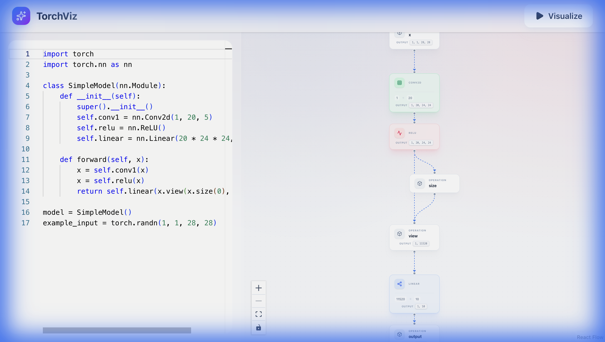

# TorchViz - Interactive PyTorch Model Visualizer



**TorchViz** is a small, interactive web application designed to help visualize PyTorch models. By combining a React Flow frontend with a `torch.fx` backend, TorchViz transforms code into beautiful, explorable graphs in real-time.

## ✨ Key Features

*   **Live Code Editing**: Write or paste your PyTorch model code directly in the browser.
*   **Interactive Visualization**: Explore your model's architecture with a zoomable, pannable graph.
*   **Automatic Shape Inference**: Just define an `example_input`, and TorchViz will calculate and display the output dimensions for every layer (e.g., `Output [1, 64, 128, 128]`).
*   **"Liquid Light" Design**: A premium, glassmorphic UI inspired by modern design systems, featuring a dynamic mesh gradient background and frosted glass elements.
*   **Detailed Metadata**: Click on any node to reveal a floating details panel with comprehensive layer information (kernel size, stride, padding, etc.).
*   **Visual Differentiation**: Layers are instantly recognizable through distinct color coding and iconography:
    *   🟢 **Convolution**: Emerald Green
    *   🔵 **Linear**: Blue
    *   🔴 **Activation**: Rose Red
    *   🟡 **Normalization**: Amber
    *   ⚪ **Pooling**: Cyan

## 🚀 Installation

### Prerequisites
*   **Python 3.8+**
*   **Node.js 16+**

### Quick Start

1.  **Clone the repository**
    ```bash
    git clone https://github.com/yourusername/torchviz.git
    cd torchviz
    ```

2.  **Run the startup script**
    This script sets up the Python virtual environment, installs dependencies, and launches both the backend and frontend servers.
    ```bash
    ./start.sh
    ```

3.  **Open in Browser**
    Navigate to `http://localhost:5173` to start visualizing!

## 📖 Usage

1.  **Define your Model**: In the code editor on the left, define your PyTorch model class and instantiate it as `model`.
2.  **Add Example Input**: To enable shape inference, define an `example_input` variable with a dummy tensor.
    ```python
    import torch
    import torch.nn as nn

    class MyModel(nn.Module):
        def __init__(self):
            super().__init__()
            self.conv1 = nn.Conv2d(1, 32, 3)
            self.relu = nn.ReLU()

        def forward(self, x):
            return self.relu(self.conv1(x))

    model = MyModel()
    example_input = torch.randn(1, 1, 28, 28)
    ```
3.  **Visualize**: Click the **Visualize** button in the header.
4.  **Explore**:
    *   Scroll to zoom, drag to pan.
    *   Click on nodes to view detailed parameters.
    *   Observe the data flow and tensor shapes at each step.

## 🛠️ Tech Stack

*   **Frontend**: React, Vite, TypeScript, TailwindCSS, React Flow, Lucide Icons.
*   **Backend**: FastAPI, PyTorch (`torch.fx`).
*   **Design**: Custom "Liquid Light" theme with glassmorphism.

---
*Built with ❤️ for the PyTorch Community.*
